# Gun Violence in America

:o: figures not done correctly

:o: fix markdown erros so that you do not have verbatim where you like to use lists, see markdown documentation

| Uma M Kugan
| umakugan@iu.edu
| Indiana University Bloomington
| hid: hid-sp18-710
| github: [:cloud:](https://github.com/cloudmesh-community/hid-sp18-710/tree/master/project-report/report.md)
| code: [:cloud:](https://github.com/cloudmesh-community/hid-sp18-710/tree/master/project-code)

---

Keywords: Gun Violence, Scikit, Fbprophet, Decision Tree, KNN, Random Forest

---

## Abstract

Gun Violence has always been the topic of debate and concern. Gun violence not only impacts its victims, but it also affects the entire community.  Just the threat of violence makes neighborhoods weaker. Guns are also involved in suicides and accidents. Exploring the data set will help us find an answer for our fear what if I and people around me are likely to be killed by a gun. Even though it is an unnecessary fear, it will at least give us a deeper understanding of how the data looks like and draw some insights. The only way to prevent gun violence is to raise the awareness of improper handling and storage of the weapons where the crime rate is high. In this paper gun violence data has been analyzed to understand if there are any patterns or trend in the increase in violence and also to predicting if the shooting victim is white or black.

## Introduction

Gun Violence in America According to CDC, "One person is killed by firearms every 17 minutes, 87 people are killed during an average day, and 609 are killed every week". Weapon brutality regardless of whether a man slaughters, suicides, or mischances-slaughters around 30,000 Americans consistently and harms 70,000 more [@hid-sp18-710-gunviolence]. At 31.2 passing's for every million individuals, Americans are nearly as prone to pass on toward the finish of a weapon as they are in an auto collision [@hid-sp18-710-gunviolence]. There is adequate worldwide research that proposes the accessibility of weapons expands the danger of deadly brutality. At the point when weapons are available, suicide endeavors will probably succeed, and ambushes will probably progress toward becoming crimes. Some exploration has shown that amassing weapons and the interest with firearms is a pointer of standoffish conduct.

## Relevant Existing Work 

We can find on the internet there is some organization who are collecting or using data from CDC to understand the trending and present data in various form for everyone to easily understand [@hid-sp18-710-national1977vital]. Mother Jones has investigated and analyzed data from 1982-2018 on US Mass Shootings [@hid-sp18-710-follman2012guide]. Fivethirtyeight.com have interactive graphics as part of their project to explore the more than 33,000 annual gun deaths in America [@hid-sp18-710-casselman2016gun]. Every-town gun safety is trying to get crowdsource funding and analyzing the various facts and issues related to gun safety and accidents [@hid-sp18-710-everytown]. All these organizations, are trying to draw some insights from the data sets and see if they can predict and stop the violence before it occurs.

## Data Collection and Preparation

The dataset we used in this project was collected from five thirty-eight's gun deaths in America using the R code from "https://data.world/azel/gun-deaths-in-america" [@hid-sp18-710-data_world]. The dataset has data from the year 2013-2017. The preparation of data is the process of transforming raw data to draw some valuable insights or make some predictions based on the past. Data Preparation will be difficult if the data have improper values or nulls. We used Python which is a high-level object-oriented programming language, most popular due to the high availability of an extensive collection of free libraries for this project.

## The Dataset

The dataset contains various information about victims of gun violence. Each row of the data set includes the year and month of the shooting, the intent of the shooter, whether the police were at the scene or not, the gender, age race and education level of the victim and finally the place where the shooting happened. The dataset also has a specific column that says if the victim is Hispanic or not. The dataset consists of the following attributes:

	- Year: It is a numerical field and holds the year of the shooting.
	
	- Month: It is a numerical field and holds the month of the shooting.
	
	- Intent: It is a text field and specifies the intentention of the shooter.
	 
	- Police: It is a numerical field and contains values 0 or 1 which indicates if the police were at the scene or not.
	
	- Sex: It is a text field and contains values M for Male and F for Females.
	 
	- Place: It is a text field and specifies where the shooting has happened
	
	- Education: It is a text field and has the education level of the victim.
	
	- Race: It is a text field, and possible values are White, Black, Hispanic, Asian/Pacific Islander and Native American/Native Alaskan.
	
	- Age: It is a numeric field and specifies the age of the victim.
	
	- Hispanic: It is a numeric field and specifies if the victim is Hispanic or not. 

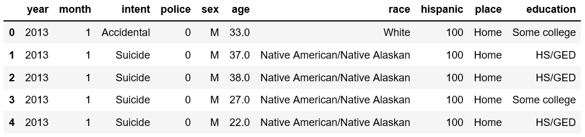{#fig:Snapshot Of Actual Dataset}

## Technologies Used
**Pandas:** Pandas is an open source library which provides tools for data mining and analysis using Python. It was primarily used in this project to prepare the data before any specific machine learning algorithms consume the data.

**NumPy:** NumPy is central Python library to handle multidimensional data and perform scientific and mathematical operations on the same. NumPy used in this project to perform some basic mathematical operations.

**Scikit-learn:** Scikit-learn is an open-source Python machine learning library which provides multiple regression, classification,  and clustering algorithms. Scikit library used in this project to build the model and prediction. It offers a variety of evaluation metrics to validate the performance of the model, which makes it a valuable tool.

**Prophet:** Prophet is an open source procedure for forecasting time series data released by Facebook. This procedure based on an additive model where non-linear trends are fit with yearly, weekly, and daily seasonality, plus holiday effects. This library works best with time series that have strong seasonal effects and several seasons of historical data. Prophet is robust to missing data and shifts in the trend, and typically handles outliers well [@hid-sp18-710-taylor_prophet].

## Data Preprocessing
In the pre-processing stage, the original dataset is modified to create a new dataset where existing columns are transformed, and handle the outliers. The columns are added, deleted or transformed based on the graphical analysis which has been performed on the data before actually building a model.

In this project, we want to if the victim is white or black. There are five classes, but we are predicting only two. The main reason to ignore other classes is that from the given data set, the rest of the classes is less than 11% of the dataset.
	
	White                             64.013604
	Black                             24.472467
	Hispanic                           9.181200
	Asian/Pacific Islander             1.388112
	Native American/Native Alaskan     0.944617

Since we are interested in only two classes, we are removing the rest of the classes from the data before we train the model. Also, there is are columns such as police and Hispanic which is not relevant to our prediction classes, and hence we ignored those columns as well from the original data set.

## Label Encoding
Label encoding is the technique that is used to convert categorical data, or text data, into numbers, so that our predictive models can better understand. Some of the columns in our data set contain text data. To run any machine learning model against the data, we can’t have text in our data. So before we run any kind of model, we need to prepare this data by converting categorical text data into model-understandable numerical data, we use the Label Encoder class. The Label Encoder class from the sklearn library, fit and transform the data, and then replace the existing text data with the new encoded data [@hid-sp18-710-medium_enocde].

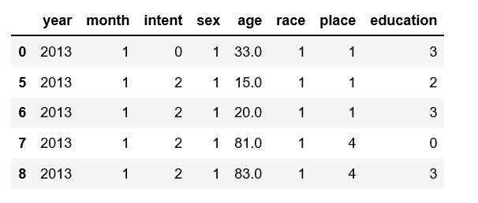{#fig:After Label Encode}

## Data Slicing

The Data slicing is the process to split data into train and test set.  The model is initially trained only with the train data.  The test data set should not be mixed up while building a model. We can use sklearn’s train_test_split method to split the data into random train and test subsets of data. The three main parameters data set, test_size which represents what percentage from the whole data set is test data and random_state variable is a pseudo-random number generator state used for random sampling. After we split the data set into train and test data, the machine learning algorithms are applied to training data.

## Decision Trees

Decision Trees are a simple and essential type of algorithm for predictive modeling machine learning. Decision trees can be easily trained with few hyper-parameter and easy to interpret. The major drawback of the decision tree is that they tend to overfit the data.
Decision Tree classifiers use decision trees to predict the value of a target variable. The decision trees are functions that are used to find which class the input nodes belong. A decision tree contains three nodes: root node, interior nodes and leaf nodes [@hid-sp18-710-decision_tree1].  Based on the condition specified in the function at internal nodes, the tree was split into two or more branches. And that's the reason why interior nodes are called s split nodes. The main advantage in a decision tree classifier is that input is tested against only specific subsets of the data which eliminates unnecessary computations [@hid-sp18-710-decision_tree2]. Another advantage is that we can use a feature selection algorithm to make a decision on which features can be used for the decision tree classifier — the lesser the number of features, the better the efficiency of the algorithm [@hid-sp18-710-decision_tree1].

The important parameters of decision tree classifiers used in our model:

	criterion: Criterion is the function that is used to measure the quality of a split. Sklearn supports Gini criteria for Gini Index and entropy for Information Gain. The default is gini value.

	max_depth: The max_depth parameter denotes the maximum depth of the tree.
	
	min_samples_leaf: The min_samples_leaf indicates the minimum number of samples required to be at a leaf node. 

The accuracy we got from implementing the decision model is 87%. Accuracy is the ratio of the correctly predicted data points to all the predicted data points. The value of accuracy determines the effectiveness of our algorithm.

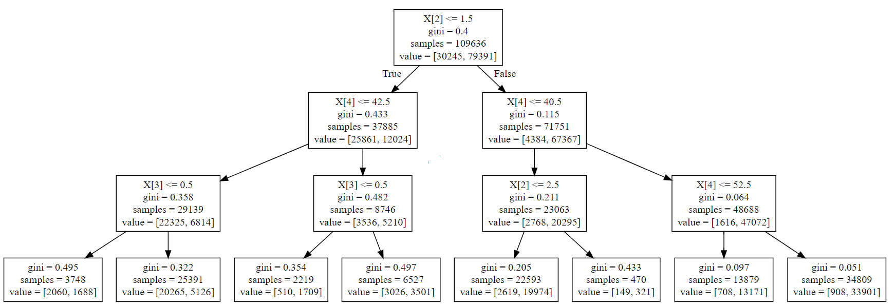{#fig:Decision Tree} 

## K-Nearest Neighbor

KNN  algorithms used mainly for both classification and regression predictive problems. The majority of the vote is taken to classify the data into one of the many categories. The labels for the new points are predicted by computing the distance between the new item and every item in the training data-set using Euclidean, Hamming or Manhattan distance. The model picks K entries which are the number of neighbors to consider which are closest to the new point. Then finally it conducts a majority vote among those data points. The most common class among those K entries will be the class of the new data point. There is no explicit training phase before the classification. KNN model keeps all the training data, and that is the reason why KNN falls under lazy learning [@hid-sp18-710-knn_algo].

In the below Figure the green circle in question would be categorized as a red triangle if k = 3 and it would be classified as a blue square if k = 5.

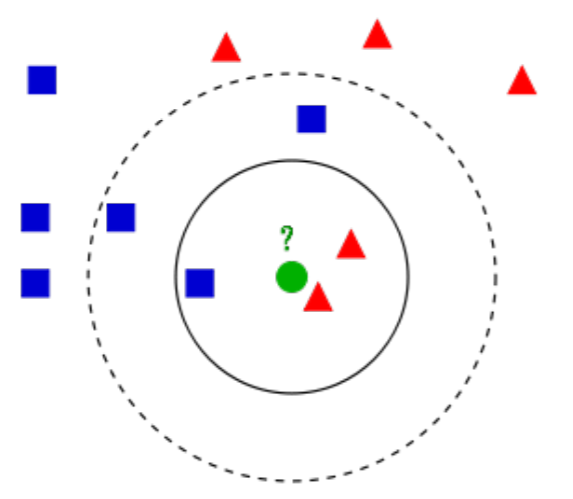{#fig:KNN Classifier|

##Random Forest
Random forest classifier creates many decision trees from a randomly selected subset of the training set and then aggregates them to decide the final class of the test object. We need first to choose random samples from a given data set, construct a decision tree for each sample and get a prediction result from each decision tree. Then Perform a vote for each predicted outcome and prediction with the most votes as the final prediction [@hid-sp18-710-breiman2001random].

{#fig:Random Forest [@hid-sp18-710-medium_ref8]}

## Prophet

A prophet is more powerful and effective in time series forecasting. Only very few tools are in the industry for forecasting. We can compare these tools and use the one that gives the best predictions with the least amount of errors. In this project, we used the prophet as it is easier to implement. Pystan is the vital module on which Prophet depends which will be installed automatically when a prophet is installed. When implementing the model, first we need to create an instance of the Prophet class and then fit it to our data set. The future is predicted using the method make_future_dataframe method by passing the attributes and frequency. The forecast dataframe has important columns: yhat which is our predicted forecast, yhat_lower contains the lower bound for our predictions and yhat_upper which is the upper bound for our predictions [@hid-sp18-710-kd_prophet]. The cross_validation method is used to measure the forecast error by comparing the predicted values and the actual values using the historical data. 

## Experimental Results

All three models performed well, But the accuracy of single decision tree model was higher than the other two models.

{#fig:Model Results}

Confusion matrix can also be used to display or describe the performance of the model. It contains the information about actual and
predicted classification calculated by the machine learning model.

From the below two graphs which was generated from the output of Prophet - Forecasting
method, it clearly shows that there is increase in tend for gun violence in next five years.

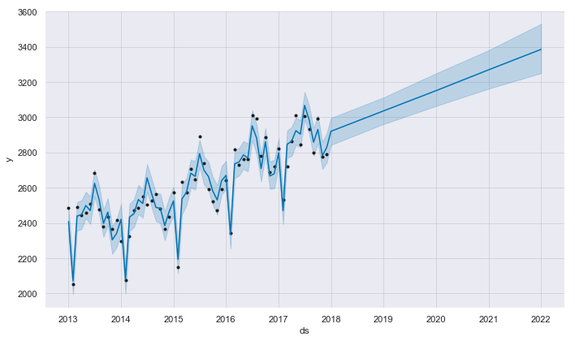{#fig:Forecast for next five years}

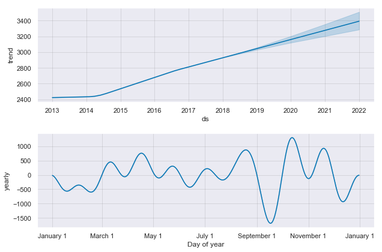{#fig:Forecast for next five years by year and month}

## Graphical Analysis Results
In this section, we would look at the results of graphical analysis which helped decide what features to include for predictions. After analyzing the data, we deleted the column police as  it does not contribute to our classification.

From the bar plot below, it is obvious that majority of the data is for black or white victims.

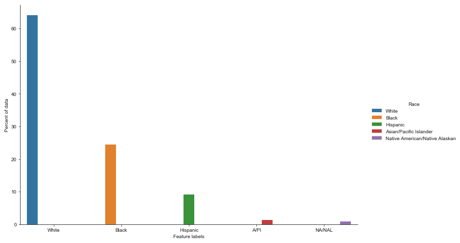{#fig:Race}

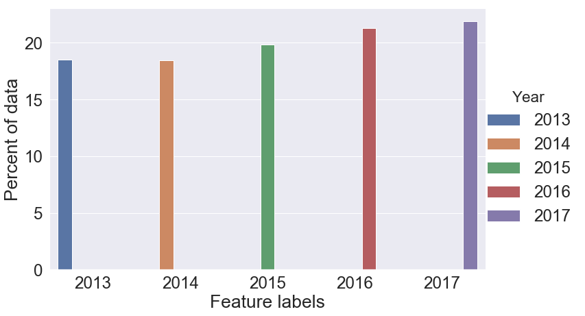{#fig:Year}

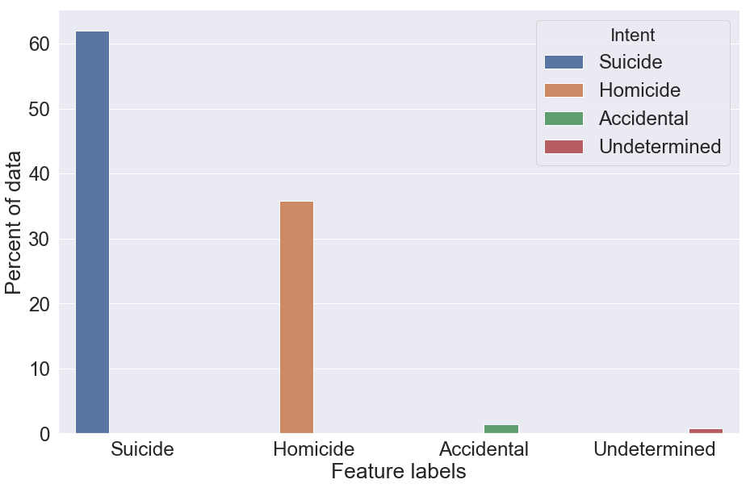{#fig:Intent}

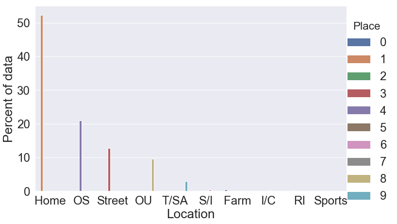{#fig:Location}

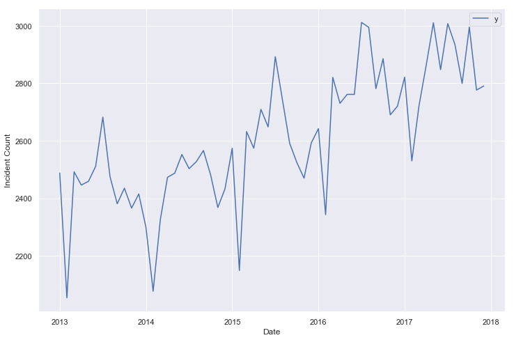{#fig:Incident Count}

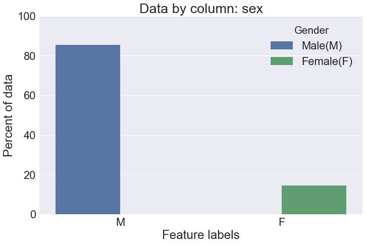{#fig:Sex Of Victims}

From the above graphs we can infer that most of the victims are male and the number of shootings have been slightly increasing year after another. The majority of the gun deaths occur at home, about 10% occur on the streets and there are very few victims with higher education levels.

The Figure below shows that for black and white victim, the intent seems to be a deciding factor, and the other three factors being age, gender and place. The education levels seems to have very less effect on deciding the race of the victim. 

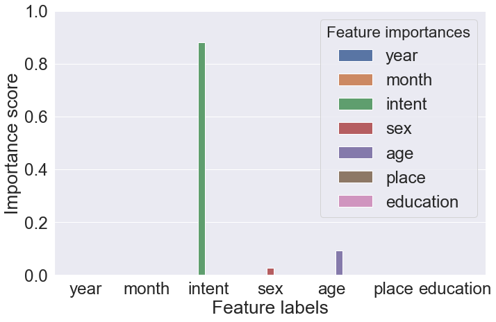{#fig:Feature}

## Limitations
In this project we have implemented simple single binary classification model. This project can be further enhanced and extended to build a multi classification model for the entire CDC multiple causes of death dataset 

## Conclusion
In this project, a detailed analysis of gun violence was conducted and prediction models were trained using three machine learning algorithms and the trending forecast was also implemented and studied.It would be interesting to study if there are more factors
like population data, gun laws data that contributes to the violence.

## Acknowledgements
The author would like to thank Dr.Gregor von Laszewski for his continued support and suggestions in writing this report and successfully completing the project.This project would not have been complete without his dedicated support and encouragements
and our sincere thanks to all our fellow students.
